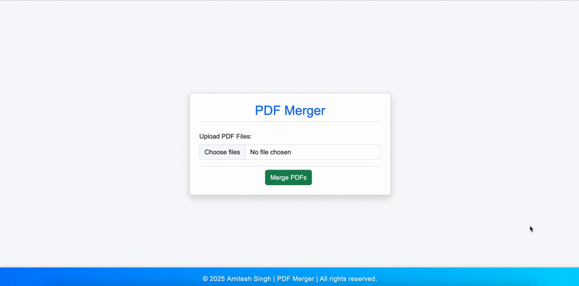

# PDF Merger
Easily merge multiple PDF files into a single document directly within your browser using JavaScript and PDF-Lib.

## Table of Contents
- [Features](#Features)
- [File-Structure](#File-Structure)
- [Technologies-Used](#Technologies-Used)
- [How-to-Use](#How-to-Use)
- [Demo](#Demo)
- [Setup](#Setup)
- [Browser-Compatibility](#Browser-Compatibility)
- [Author](#Author)

## Features
- Merge multiple PDF files into a single PDF.
- User-friendly interface built with Bootstrap.
- Client-side processing – No server required.
- Fast and lightweight solution.
- Drag & drop support for easy file uploads.

## File-Structure
- │── index.html           # Main HTML file
- │── convertpdf.js        # JavaScript file for PDF conversion
- │── index.css            # Stylesheet
- │── README.md            # Project documentation

## Technologies-Used
- **HTML5, CSS3, Bootstrap** – For a responsive UI.
- **JavaScript (PDF-Lib.js)** – For merging PDF files.
- **JS-PDF** – Additional PDF handling.

## How-to-Use
- Open index.html in a browser.
- Click on the file input and select one or more PDF files.
- Click the **"Merge PDFs"** button to start processing.
- The merged PDF will be automatically downloaded.

### Demo

## Setup
- Clone the repository: `git clone https://github.com/amitesh786/PDF-Merger.git`
- cd PDF-Merger
- Open index.html in a browser and start using the tool!

## Browser-Compatibility
- Chrome
- Firefox
- Edge
- Safari (limited support due to PDF-Lib limitations (Not supported))

## Author
- Developed by Amitesh Singh | © 2025
- Feel free to contribute or suggest improvements!
